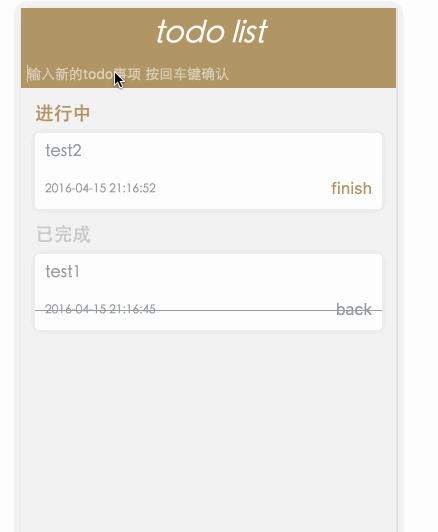

# koa-todo-list
##基于koa的todo

> 这是一个基于koa的todo小demo

## clone

``` javascript
git clone https://github.com/qianlongo/koa-todo-list.git

```


## install

``` javascript
cd koa-todo-list && npm install
```

## run

``` javascript
gulp

```

## preview

``` javascript
localhost:3000

```

## 效果

